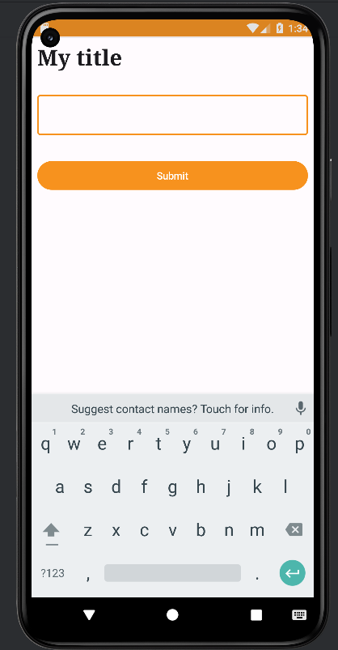

# Oulu University of Applied Sciences - Android Theme Customization Assignment

**Compatible with API Level 25**

This repository contains a series of exercises focusing on customizing the theme of an Android application using Jetpack Compose.

## Demo

## Assignment Overview

The assignment consists of six steps, each focusing on a different aspect of theming in Jetpack Compose. The steps are as follows:

1. **Walkthrough: Theming**
   - Introduction to theming in Android using Jetpack Compose.
   - Demonstration of modifying default theme values to create a custom theme.
   - Implementation of a simple app showcasing theme modifications.

2. **Create a Modifier for Consistent Layout**
   - Creation of a modifier to ensure consistent layout and appearance across composables.
   - Demonstration of using MaterialTheme to retrieve styles and values from the theme.

3. **Changing Default Theme Values**
   - Instructions on changing default theme values such as colors, shapes, and typography.
   - Example of changing the primary color and typography definitions.

4. **Testing Theme Changes**
   - Instructions to test the app after making theme modifications.
   - Observing automatic changes in UI elements like buttons due to theme adjustments.

5. **Changing Typography and Shapes**
   - Guidelines for overriding typography and shape definitions from the theme.
   - Example of modifying text styles and button shapes.

6. **Observing Theme Changes**
   - Checking the app to see the effects of theme modifications, such as updated button corners.
   - Emphasis on the flexibility of theme customization to align with design requirements.

## Why Theming Matters

Theming plays a crucial role in defining the visual identity and user experience of an application. By customizing the theme, developers can ensure consistency in appearance and behavior across different screens and interactions. Additionally, theming allows apps to adapt to different user preferences, such as light and dark modes.

## Best Practices

- Centralize theme definitions to maintain consistency and reusability.
- Utilize tools like Material Design Theme Builder for exporting and managing theme files.
- Regularly test theme changes to ensure they meet design specifications and user expectations.

## Resources

- [Material Design Theme Builder](https://m3.material.io/theme-builder#/custom): Tool for generating and exporting theme files compatible with Jetpack Compose.
- [Converting Colors](https://convertingcolors.com): Website for converting color codes to different formats.

## Author

This assignment was created by Jouni Juntunen for the Spring 2023 semester of the Information Technology program at Oulu University of Applied Sciences.

